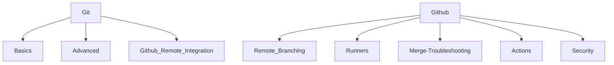

# GITHUB / GIT Course
This repository was created to practice from the basics to advanced Github/Git commands, CI/CD, Github Actions.

```mermaid
graph TD;
    Git-->Basics
    Git-->Advanced;
    Git-->Github_Remote_Integration
    Github-->Remote_Branching
    Github-->Runners;
    Github-->Merge-Troubleshooting
    Github-->Actions;
    Github-->Security;
```